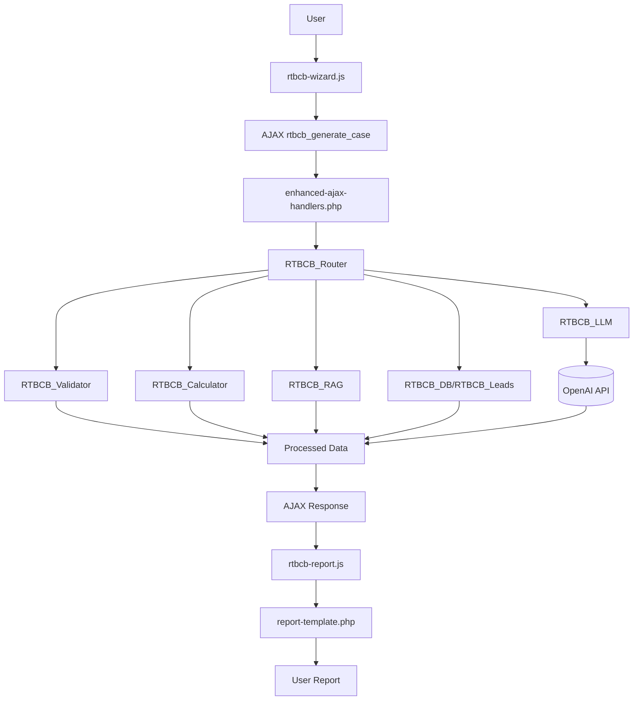

# Real Treasury Business Case Builder

## Project Overview
- **Plugin Name:** Real Treasury – Business Case Builder  
- **Purpose:** WordPress plugin that creates ROI-driven business cases for treasury technology investments
- **Features:** Multi-step wizard, OpenAI-powered narrative generation, comprehensive PDF reports
- **Audience:** Prospective customers evaluating treasury technology solutions

## Technology Stack
- **Platform:** WordPress 6.0+ Plugin
- **Languages:** PHP 7.4+, JavaScript (ES6), CSS
- **Framework:** WordPress with OpenAI API integration
- **Runtime:** LAMP/LEMP stack, MySQL/MariaDB
- **Size:** ~85 files, ~15,000 lines of code

## Quick Start

### Prerequisites
```bash
# Install PHP dependencies
composer install

# Verify environment
php --version  # Must be 7.4+
```

### Validation
```bash
# PHP syntax check
find . -name "*.php" -not -path "./vendor/*" -print0 | xargs -0 -n1 php -l

# Run test suite
bash tests/run-tests.sh
```

## Directory Structure

```
real-treasury-business-case-builder/
├── .editorconfig
├── .eslintrc.json
├── .gitignore
├── AGENTS.md
├── README.md
├── WORDPRESS_COM_COMPATIBILITY.md
├── composer.json
├── composer.lock
├── package.json
├── phpcs.xml.dist
├── phpunit.xml.dist
├── readme.txt
├── real-treasury-business-case-builder.php    # Main plugin file
├── admin/                                     # WordPress admin interface
│   ├── AGENTS.md
│   ├── assets/
│   │   ├── css/admin-modern.css
│   │   └── js/admin-modern.js
│   ├── classes/Admin.php
│   ├── includes/
│   │   ├── analytics-processor.php
│   │   └── leads-exporter.php
│   └── views/                              # Admin page templates
│       ├── analytics/
│       │   └── main.php
│       ├── dashboard/
│       │   └── main.php
│       ├── leads/
│       │   └── main.php
│       └── settings/
│           └── main.php
├── bin/install-wp-tests.sh                   # WordPress test setup
├── inc/                                     # Core PHP classes
│   ├── AGENTS.md
│   ├── api/openai-client.php               # OpenAI integration
│   ├── class-rtbcb-calculator.php          # ROI calculation engine
│   ├── class-rtbcb-category-recommender.php
│   ├── class-rtbcb-db.php                  # Database operations
│   ├── class-rtbcb-error-handler.php
│   ├── class-rtbcb-leads.php               # Lead management
│   ├── class-rtbcb-llm.php                 # LLM integration
│   ├── class-rtbcb-performance-monitor.php
│   ├── class-rtbcb-rag.php                 # Vector search
│   ├── class-rtbcb-router.php              # Request routing
│   ├── class-rtbcb-validator.php           # Input validation
│   ├── config.php                          # Configuration
│   └── utils/helpers.php                   # Utility functions
├── languages/                               # Internationalization
│   ├── README.md
│   └── rtbcb.pot
├── public/                                  # Frontend assets
│   ├── AGENTS.md
│   ├── css/rtbcb.css                       # Main styles
│   └── js/
│       ├── chart.min.js                    # Chart library
│       └── rtbcb-wizard.js                 # Multi-step form
├── scripts/                                 # Build tools
│   ├── build-plugin-zip.js
│   └── build-simple.js
├── templates/                               # PHP templates
│   ├── AGENTS.md
│   ├── business-case-form.php              # User-facing wizard
│   ├── comprehensive-report-template.php
│   └── report-template.php
└── tests/                                   # Test suite
    ├── README.md
    ├── api/
    ├── bootstrap/
    ├── integration/
    ├── unit/
    ├── run-tests.sh                        # Master test runner
    └── *.test.php                          # PHP unit tests
```

## Core Features

### Multi-Step Business Case Wizard
- Company profile data collection
- Treasury operations assessment  
- ROI calculations and projections
- Lead capture and management

### AI-Powered Narrative Generation
- OpenAI GPT-4/GPT-4o integration
- Context-aware business case writing
- Industry-specific recommendations
- Fallback for missing API keys

### Admin Dashboard
- Lead analytics and reporting
- Export functionality
- Performance monitoring
- WordPress.com compatibility

### Technical Architecture
1. **Frontend:** Shortcode `[rt_business_case_builder]` renders wizard
2. **AJAX Processing:** Secure nonce-validated endpoints
3. **Orchestration:** Router coordinates validation, calculation, RAG, LLM
4. **Output:** JSON response → HTML report → optional PDF

## Database Schema
- `wp_rtbcb_leads`: Lead data and ROI results
- `wp_rtbcb_rag_index`: Vector embeddings for search

## Development

### Testing
```bash
# PHP syntax validation  
find . -name "*.php" -not -path "./vendor/*" -print0 | xargs -0 -n1 php -l

# Run full test suite
bash tests/run-tests.sh

# Specific test categories
php tests/json-output-lint.php
php tests/cosine-similarity-search.test.php
php tests/scenario-selection.test.php
node tests/handle-submit-error.test.js
```

### Code Standards
- WordPress PHP Coding Standards
- 4-space indentation (not tabs)
- Function prefix: `rtbcb_`, Class prefix: `RTBCB_`
- All input sanitized, all output escaped
- Internationalization ready

### Security Features
- WordPress nonce verification
- Capability checks for admin functions
- Input sanitization and output escaping
- WordPress.com compatibility

## Installation

1. Upload plugin files to `/wp-content/plugins/real-treasury-business-case-builder/`
2. Activate plugin through WordPress admin
3. Configure OpenAI API key (optional)
4. Add shortcode `[rt_business_case_builder]` to any page

## Requirements
- **WordPress:** 6.0+
- **PHP:** 7.4+
- **Memory:** 256MB+ (for LLM operations)
- **MySQL/MariaDB:** Any recent version
- **OpenAI API Key:** Optional (graceful fallbacks)

## License
GPL v2 or later

---

*Last updated: August 2024*
- **class-rtbcb-performance-monitor.php** – Performance monitoring and optimization.

#### Admin Interface (`/admin/`)
- **classes/Admin.php** – Main admin class that registers menus and handles admin functionality.
- **views/dashboard/main.php** – Main dashboard with quick links and statistics.
- **views/leads/main.php** – Lead management interface with filtering and export options.
- **views/analytics/main.php** – Usage analytics and chart rendering.
- **views/settings/main.php** – Plugin settings and configuration interface.
- **includes/analytics-processor.php** – Backend analytics data processing.
- **includes/leads-exporter.php** – Lead data export functionality.
- **assets/css/admin-modern.css** – Modern styling for admin interface.
- **assets/js/admin-modern.js** – JavaScript for enhanced admin functionality.

#### Frontend Assets (`/public/`)
- **css/rtbcb.css** – Main styling for the modal wizard and reports.
- **js/rtbcb-wizard.js** – Multi-step wizard controller and form submission.
- **js/chart.min.js** / **chartjs-license.txt** – Bundled Chart.js library and license.

#### Templates (`/templates/`)
- **business-case-form.php** – HTML markup for the user-facing wizard interface.
- **report-template.php** – Base report layout populated with LLM output.
- **comprehensive-report-template.php** – Extended report template with executive summary and detailed analysis.

#### Testing Suite (`/tests/`)
- **run-tests.sh** – Executes linting, unit tests, integration tests, and JavaScript checks.
- **admin-menu-registration.test.php** – PHPUnit test verifying admin menu registration and WordPress.com compatibility.
- **admin-menu-verification.test.php** – Verification tests for admin menu functionality.
- **admin-menu-fix-verification.test.php** – Tests for admin menu fixes and improvements.
- **api/openai-connection.test.php** – Tests OpenAI API connectivity.
- **api/openai-error-handling.test.php** – Tests OpenAI API error handling.
- **integration/admin-interface.test.php** – Integration tests for admin interface.
- **unit/calculator-engine.test.php** – Unit tests for calculation engine.
- **php83-compatibility.test.php** – PHP 8.3 compatibility testing.
- **wordpress-com-compatibility.test.php** – WordPress.com specific compatibility tests.
- **bootstrap/bootstrap.php** – Test bootstrap and setup utilities.

#### Translations (`/languages/`)
- **README.md** – Translation documentation and guidelines.
- **rtbcb.pot** – Translation template file for internationalization.

#### Dependencies (`/vendor/`)
- **[composer dependencies]** – Autoloaded libraries installed via Composer.

## 3. Execution Flow & Data Lifecycle
1. **User Interaction:** The shortcode renders `templates/business-case-form.php`, and `public/js/rtbcb-wizard.js` guides the user through a multi-step wizard.
2. **AJAX Request:** On submission, the wizard sends collected data to the WordPress AJAX system.
3. **Backend Handling:** The admin interface receives the request and delegates to `RTBCB_Router`.
4. **Data Processing:** The router validates input, runs `RTBCB_Calculator` for ROI figures, and fetches contextual data through `RTBCB_RAG`.
5. **LLM Interaction:** `RTBCB_LLM` formats the prompt with calculations and context, then calls the configured OpenAI model.
6. **Response Parsing:** The JSON reply is parsed into structured fields.
7. **AJAX Response:** Processed numbers and narrative text are returned as JSON, including rendered report HTML.
8. **Report Rendering:** Frontend JavaScript injects the HTML into the appropriate template and draws charts.

## 4. Key API Endpoints
| Action | Purpose | Expects | Returns |
| ------ | ------- | ------- | ------- |
| WordPress AJAX System | Generate business case from wizard data | Company profile, operations metrics, pain points | `report_html`, `report_id`, status message |
| Admin Interface | Admin functionality for lead management | Authenticated admin requests | Admin dashboard, analytics, settings |
| OpenAI API Integration | LLM-powered narrative generation | Formatted prompts with context | JSON responses with business case narratives |

## 5. Installation & Setup

### Production Installation (WordPress.com)
1. Download the latest release ZIP from the [releases page](https://github.com/RealTreasury/business-case-builder/releases)
2. Upload via WordPress admin: **Plugins → Add New → Upload Plugin**
3. Activate the plugin
4. Navigate to **Real Treasury → Settings** and enter your OpenAI API key

### Local Development Setup
1. **Prerequisites**: Node.js 16+, PHP 7.4+, Composer
2. **Clone and setup**:
   ```bash
   git clone https://github.com/RealTreasury/business-case-builder.git
   cd business-case-builder
   npm run setup
   ```
3. **Start WordPress development environment**:
   ```bash
   npm run wp-env:start
   ```
4. **Access local site**: http://localhost:8888 (admin: admin/password)

## 6. Development Workflow

### Quick Start Commands
```bash
# Setup development environment
npm run setup

# Start WordPress environment
npm run wp-env:start

# Run all tests
npm run test

# Code quality checks
npm run lint

# Build production package
npm run build
```

### Testing Framework
- **PHP Unit Tests**: `composer test` or `npm run test:php`
  - PHPUnit 9.6 with WordPress test suite
  - Coverage reporting included
  - WordPress.com compatibility verified
- **JavaScript Tests**: `npm run test:js`
  - Custom test runner for existing JS tests
- **End-to-End Tests**: `npm run test:e2e`
  - Cypress with WordPress.com optimizations
  - Custom commands for WordPress testing
- **Code Quality**: 
  - WordPress Coding Standards via `npm run lint:php`
  - ESLint for JavaScript via `npm run lint:js`
  - PHP compatibility checking

### WordPress.com Deployment
```bash
# Build WordPress.com compatible package
npm run build

# Generated ZIP ready for upload in build/ directory
```

See [DEPLOYMENT.md](DEPLOYMENT.md) for detailed WordPress.com deployment instructions.

## 8. Troubleshooting

### Admin Menu Not Visible on WordPress.com

If you cannot see the "Real Treasury" admin menu after plugin activation, use the diagnostic script:

1. **Upload the diagnostic script**: Download `admin-debug.php` from the plugin files and upload it to your WordPress root directory
2. **Access the diagnostic URL**: Visit `https://yourdomain.com/admin-debug.php` in your browser
3. **Review the output**: The script will check:
   - Plugin activation status and class availability
   - User permissions and WordPress.com capability requirements
   - Environment detection (WordPress.com vs self-hosted)
   - Actual admin menu registration status in real-time
   - Provides specific troubleshooting recommendations

Common causes and solutions:
- **User Permissions**: WordPress.com may require `edit_pages` capability instead of `manage_options`
- **Plugin Conflicts**: Other plugins may interfere with menu registration
- **PHP Errors**: Silent errors may prevent the admin class from loading
- **Environment Issues**: WordPress.com-specific hosting restrictions

**Important**: Remove the `admin-debug.php` file after troubleshooting for security purposes.

## 9. Visual Architecture Diagram

