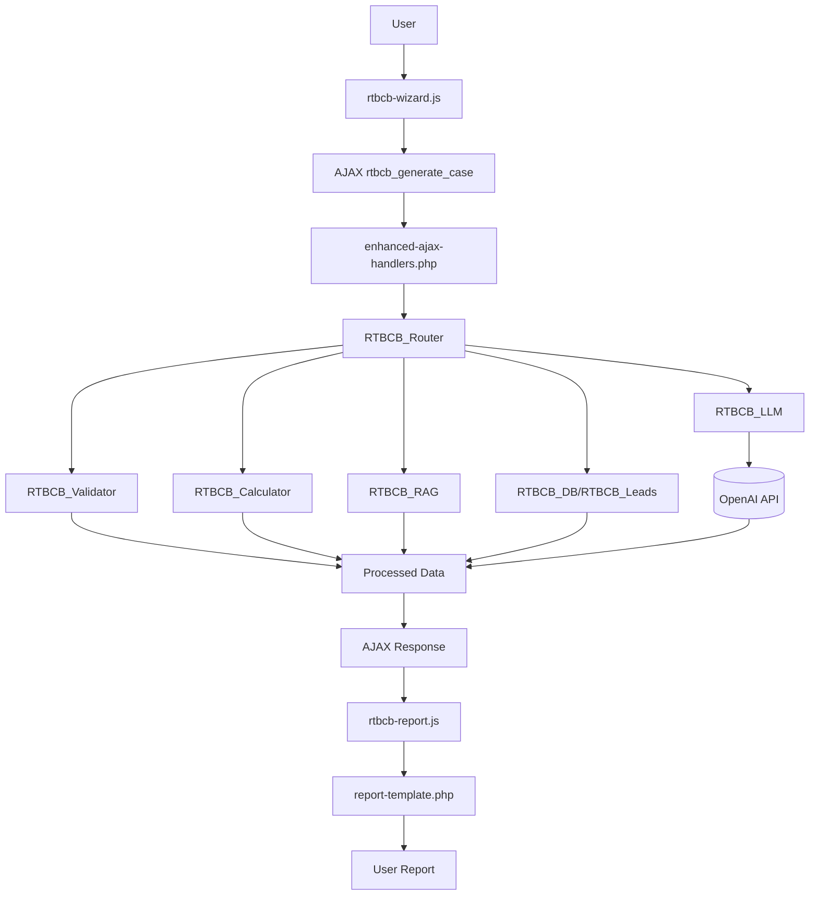

# Real Treasury Business Case Builder

## 1. Project Summary
- **Plugin Name:** Real Treasury – Business Case Builder (Enhanced Pro)
- **Purpose:** Multi-step wizard that gathers company profile and treasury operations data, performs ROI calculations, and invokes a Large Language Model (LLM) to produce a customized business case report for prospective customers of Real Treasury.
- **Primary Audience:**
  - **End Users:** Prospective customers evaluating treasury technology.
  - **Administrators:** Real Treasury marketing and sales teams managing leads and analytics.

## 2. Complete File Structure

### Directory Overview
```
real-treasury-business-case-builder/
├── .editorconfig
├── .eslintrc.json
├── .gitignore
├── .htaccess
├── .wp-env.json
├── AGENTS.md
├── DEPLOYMENT.md
├── README.md
├── readme.txt
├── composer.json
├── composer.lock
├── cypress.config.js
├── package.json
├── phpcs.xml.dist
├── phpunit.xml.dist
├── real-treasury-business-case-builder.php
├── .github/
│   └── workflows/
│       └── ci.yml
├── admin/
│   ├── AGENTS.md
│   ├── analytics-page.php
│   ├── class-rtbcb-admin.php
│   ├── dashboard-page.php
│   ├── leads-page-enhanced.php
│   ├── unified-test-dashboard-page.php
│   ├── css/
│   │   ├── rtbcb-admin.css
│   │   └── unified-test-dashboard.css
│   └── js/
│       └── unified-test-dashboard.js
├── bin/
│   └── install-wp-tests.sh
├── inc/
│   ├── AGENTS.md
│   ├── class-rtbcb-calculator.php
│   ├── class-rtbcb-category-recommender.php
│   ├── class-rtbcb-db.php
│   ├── class-rtbcb-leads.php
│   ├── class-rtbcb-llm.php
│   ├── class-rtbcb-rag.php
│   ├── class-rtbcb-router.php
│   ├── class-rtbcb-validator.php
│   ├── config.php
│   ├── enhanced-ajax-handlers.php
│   ├── helpers.php
│   └── model-capabilities.php
├── public/
│   ├── AGENTS.md
│   ├── class-rtbcb-category-recommender.php
│   ├── class-rtbcb-db.php
│   ├── class-rtbcb-leads.php
│   ├── class-rtbcb-llm.php
│   ├── class-rtbcb-rag.php
│   ├── class-rtbcb-router.php
│   ├── class-rtbcb-validator.php
│   ├── config.php
│   ├── enhanced-ajax-handlers.php
│   ├── helpers.php
│   └── model-capabilities.php
├── public/
│   ├── AGENTS.md
│   ├── css/
│   │   ├── rtbcb-variables.css
│   │   └── rtbcb.css
│   └── js/
│       ├── chart.min.js
│       ├── chartjs-license.txt
│       ├── rtbcb.js
│       ├── rtbcb-wizard.js
│       └── rtbcb-report.js
├── scripts/
│   └── build-plugin-zip.js
├── templates/
│   ├── AGENTS.md
│   ├── business-case-form.php
│   ├── comprehensive-report-template.php
│   └── report-template.php
├── tests/
│   ├── bootstrap.php
│   ├── run-js-tests.js
│   ├── run-tests.sh
│   ├── cypress/
│   │   └── support/
│   │       ├── commands.js
│   │       └── e2e.js
│   ├── unit/
│   │   └── OpenAIErrorHandlingTest.php
│   ├── integration/
│   └── [existing test files...]
├── tests/
│   ├── RTBCB_AjaxGenerateComprehensiveCaseErrorTest.php
│   ├── acceptance.cy.js
│   ├── api-tester-gpt5-mini.test.php
│   ├── cosine-similarity-search.test.php
│   ├── filters-override.test.php
│   ├── gpt5-responses-api.test.php
│   ├── gpt5-responses-live.test.php
│   ├── handle-server-error-display.test.js
│   ├── handle-submit-error.test.js
│   ├── handle-submit-success.test.js
│   ├── json-output-lint.php
│   ├── mini-model-dynamic.test.php
│   ├── openai-error-handling.test.php
│   ├── parse-comprehensive-response.test.php
│   ├── reasoning-first-output.test.php
│   ├‑‑ render-results-no-narrative.test.js
│   ├── run-tests.sh
│   ├── scenario-selection.test.php
│   ├── temperature-model.test.js
│   └── helpers/
│       ├── capture-call-openai-body.php
│       └── wp-http.php
├── languages/ ⚠️ (Referenced for translations but directory missing)
└── vendor/
    ├── AGENTS.md
    └── [composer dependencies]
```

### File Descriptions

#### Root Directory Files
- **real-treasury-business-case-builder.php** – Bootstrap file that defines constants, registers hooks, and loads core classes.
- **composer.json** – PHP dependency configuration for Composer.
- **composer.lock** – Locked versions of Composer dependencies.
- **readme.txt** – WordPress.org metadata for plugin distribution.
- **.htaccess** – Example Apache rules to prevent direct access.
- **AGENTS.md** – Contributor guidelines and coding standards.

#### Core Classes (`/inc/`)
- **config.php** – Defines configuration constants and default settings.
- **helpers.php** – Utility functions shared across the plugin.
- **enhanced-ajax-handlers.php** – AJAX endpoint implementations and diagnostic tools.
- **class-rtbcb-calculator.php** – ROI calculation engine for multiple scenarios.
- **class-rtbcb-router.php** – Coordinates validation, calculations, RAG, and LLM calls.
- **class-rtbcb-llm.php** – Interfaces with OpenAI models to generate narrative reports.
- **class-rtbcb-rag.php** – Retrieval-Augmented Generation for contextual data lookup.
- **class-rtbcb-leads.php** – Captures, stores, and manages lead records.
- **class-rtbcb-db.php** – Handles database schema creation and upgrades.
- **class-rtbcb-category-recommender.php** – Suggests product categories based on inputs.
- **class-rtbcb-validator.php** – Sanitizes and validates user-submitted data.
- **model-capabilities.php** – Lists model features and limitations for AI calls.

#### Admin Interface (`/admin/`)
- **class-rtbcb-admin.php** – Registers admin menus, enqueues assets, and processes dashboard actions.
- **dashboard-page.php** – Main dashboard with quick links and statistics.
- **leads-page-enhanced.php** – Lead management table with filtering and export options.
- **analytics-page.php** – Usage analytics and chart rendering.
- **unified-test-dashboard-page.php** – Centralized testing interface for plugin components.
- **css/rtbcb-admin.css** – Core styles for all admin pages.
- **css/unified-test-dashboard.css** – Styling for the unified test dashboard.
- **js/unified-test-dashboard.js** – JavaScript powering the testing dashboard with a circuit breaker, progress tracking, and notification utilities.

##### Unified Test Dashboard
Navigate to **Real Treasury → Unified Tests** in the WordPress admin to run LLM, RAG, and API checks. The dashboard displays progress for each test, halts sequences via a circuit breaker on repeated failures, and surfaces notifications summarizing results.

#### Frontend Assets (`/public/`)
- **css/rtbcb-variables.css** – CSS variables and theme tokens.
- **css/rtbcb.css** – Main styling for the modal wizard and reports.
- **js/rtbcb-wizard.js** – Multi-step wizard controller and form submission.
- **js/rtbcb-report.js** – Renders generated reports and initializes Chart.js.
- **js/rtbcb.js** – Shared frontend utilities and error handling.
- **js/chart.min.js** / **chartjs-license.txt** – Bundled Chart.js library and license.

#### Templates (`/templates/`)
- **business-case-form.php** – HTML markup for the user-facing wizard interface.
- **report-template.php** – Base report layout populated with LLM output.
- **comprehensive-report-template.php** – Extended report template with executive summary and detailed analysis.

#### Testing Suite (`/tests/`)
- **run-tests.sh** – Executes linting, unit tests, integration tests, and JavaScript checks.
- **acceptance.cy.js** – Cypress end-to-end test for the full user journey.
- **RTBCB_AjaxGenerateComprehensiveCaseErrorTest.php** – PHPUnit test verifying AJAX error handling.
- **api-tester-gpt5-mini.test.php** – Validates OpenAI API tester for GPT‑5 Mini.
- **cosine-similarity-search.test.php** – Ensures vector search accuracy for RAG.
- **filters-override.test.php** – Confirms WordPress filter overrides work as expected.
- **gpt5-responses-api.test.php** – Tests API-based GPT‑5 response handling.
- **gpt5-responses-live.test.php** – Performs live GPT‑5 response validation.
- **handle-submit-error.test.js** – Checks frontend error display on submission failure.
- **handle-server-error-display.test.js** – Verifies server error messages are surfaced to users.
- **handle-submit-success.test.js** – Confirms successful submission flow.
- **render-results-no-narrative.test.js** – Tests rendering when narrative text is absent.
- **temperature-model.test.js** – Tests model selection by temperature capability.
- **json-output-lint.php** – Lints stored JSON outputs.
- **mini-model-dynamic.test.php** – Checks dynamic selection of mini LLM models.
- **openai-error-handling.test.php** – Exercises error handling paths for OpenAI failures.
- **parse-comprehensive-response.test.php** – Validates parsing of full LLM responses.
- **reasoning-first-output.test.php** – Tests reasoning-first generation mode.
- **scenario-selection.test.php** – Ensures ROI scenario selection logic.
- **helpers/capture-call-openai-body.php** – Captures OpenAI request bodies for assertions.
- **helpers/wp-http.php** – WordPress HTTP stubs for testing.

#### Translations (`/languages/`)
- ⚠️ Directory expected by `load_plugin_textdomain()` but no translation files are currently provided.

#### Dependencies (`/vendor/`)
- **AGENTS.md** – Notes that vendor files are third-party dependencies and should not be modified.
- **[composer dependencies]** – Autoloaded libraries installed via Composer.

## 3. Execution Flow & Data Lifecycle
1. **User Interaction:** The shortcode renders `templates/business-case-form.php`, and `public/js/rtbcb-wizard.js` guides the user through a multi-step wizard.
2. **AJAX Request:** On submission, the wizard sends collected data to the WordPress AJAX action `rtbcb_generate_case`.
3. **Backend Handling:** `inc/enhanced-ajax-handlers.php` receives the request and delegates to `RTBCB_Router`.
4. **Data Processing:** The router validates input, runs `RTBCB_Calculator` for ROI figures, and fetches contextual data through `RTBCB_RAG`.
5. **LLM Interaction:** `RTBCB_LLM` formats the prompt with calculations and context, then calls the configured OpenAI model.
6. **Response Parsing:** The JSON reply is parsed into structured fields.
7. **AJAX Response:** Processed numbers and narrative text are returned as JSON, including rendered report HTML.
8. **Report Rendering:** `public/js/rtbcb-report.js` injects the HTML into `templates/report-template.php` (or the comprehensive template) and draws charts.

## 4. Key API Endpoints
| Action | Purpose | Expects | Returns |
| ------ | ------- | ------- | ------- |
| `rtbcb_generate_case` | Generate business case from wizard data | Company profile, operations metrics, pain points | `report_html`, `report_id`, status message |
| `rtbcb_run_llm_test` | Compare multiple LLM models for diagnostics | `modelIds`, `promptA/B`, `maxTokens`, `temperature` | Array of model responses with latency and token metrics |
| `rtbcb_run_rag_test` | Evaluate retrieval quality of the RAG index | `queries`, `topK`, `evaluationMode` | Retrieval results and scoring metrics |
| `rtbcb_api_health_ping` | Check OpenAI API connectivity and rate limits | None beyond nonce | Health status and rate-limit headers |
| `rtbcb_generate_preview_report` | Build a full HTML report in the Unified Test Dashboard | Authenticated request, nonce | Sanitized report HTML |

## 5. Installation & Setup

### Production Installation (WordPress.com)
1. Download the latest release ZIP from the [releases page](https://github.com/RealTreasury/business-case-builder/releases)
2. Upload via WordPress admin: **Plugins → Add New → Upload Plugin**
3. Activate the plugin
4. Navigate to **Real Treasury → Settings** and enter your OpenAI API key

### Local Development Setup
1. **Prerequisites**: Node.js 16+, PHP 7.4+, Composer
2. **Clone and setup**:
   ```bash
   git clone https://github.com/RealTreasury/business-case-builder.git
   cd business-case-builder
   npm run setup
   ```
3. **Start WordPress development environment**:
   ```bash
   npm run wp-env:start
   ```
4. **Access local site**: http://localhost:8888 (admin: admin/password)

## 6. Development Workflow

### Quick Start Commands
```bash
# Setup development environment
npm run setup

# Start WordPress environment
npm run wp-env:start

# Run all tests
npm run test

# Code quality checks
npm run lint

# Build production package
npm run build
```

### Testing Framework
- **PHP Unit Tests**: `composer test` or `npm run test:php`
  - PHPUnit 9.6 with WordPress test suite
  - Coverage reporting included
  - WordPress.com compatibility verified
- **JavaScript Tests**: `npm run test:js`
  - Custom test runner for existing JS tests
- **End-to-End Tests**: `npm run test:e2e`
  - Cypress with WordPress.com optimizations
  - Custom commands for WordPress testing
- **Code Quality**: 
  - WordPress Coding Standards via `npm run lint:php`
  - ESLint for JavaScript via `npm run lint:js`
  - PHP compatibility checking

### WordPress.com Deployment
```bash
# Build WordPress.com compatible package
npm run build

# Generated ZIP ready for upload in build/ directory
```

See [DEPLOYMENT.md](DEPLOYMENT.md) for detailed WordPress.com deployment instructions.

## 7. Visual Architecture Diagram

