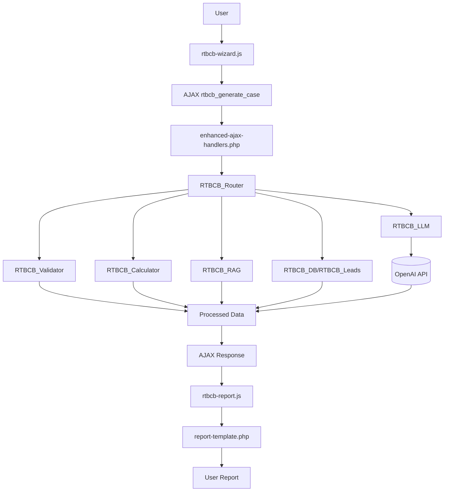

# Real Treasury Business Case Builder

## 1. Project Summary
- **Plugin Name:** Real Treasury – Business Case Builder (Enhanced Pro)
- **Purpose:** Multi-step wizard that gathers company profile and treasury operations data, performs ROI calculations, and invokes a Large Language Model (LLM) to produce a customized business case report for prospective customers of Real Treasury.
- **Primary Audience:**
  - **End Users:** Prospective customers evaluating treasury technology.
  - **Administrators:** Real Treasury marketing and sales teams managing leads and analytics.

## 2. Complete File Structure

### Directory Overview
```
real-treasury-business-case-builder/
├── .editorconfig
├── .eslintrc.json
├── .htaccess
├── .wp-env.json
├── ADMIN_MENU_VERIFICATION_REPORT.md
├── AGENTS.md
├── API.md
├── ARCHITECTURE.md
├── CONTRIBUTING.md
├── DEPLOYMENT.md
├── DEVELOPER.md
├── README.md
├── SECURITY.md
├── WORDPRESS_COM_COMPATIBILITY.md
├── admin-debug.php
├── composer.json
├── composer.lock
├── cypress.config.js
├── package.json
├── phpcs.xml.dist
├── phpunit.xml.dist
├── readme.txt
├── real-treasury-business-case-builder.php
├── admin/
│   ├── AGENTS.md
│   ├── assets/
│   │   ├── css/
│   │   │   └── admin-modern.css
│   │   └── js/
│   │       └── admin-modern.js
│   ├── classes/
│   │   └── Admin.php
│   ├── includes/
│   │   ├── analytics-processor.php
│   │   └── leads-exporter.php
│   └── views/
│       ├── analytics/
│       │   └── main.php
│       ├── dashboard/
│       │   └── main.php
│       ├── leads/
│       │   └── main.php
│       └── settings/
│           └── main.php
├── bin/
│   └── install-wp-tests.sh
├── inc/
│   ├── AGENTS.md
│   ├── README.md
│   ├── api/
│   │   └── openai-client.php
│   ├── class-rtbcb-calculator-old.php
│   ├── class-rtbcb-calculator.php
│   ├── class-rtbcb-category-recommender.php
│   ├── class-rtbcb-db.php
│   ├── class-rtbcb-error-handler.php
│   ├── class-rtbcb-leads.php
│   ├── class-rtbcb-llm-old.php
│   ├── class-rtbcb-llm.php
│   ├── class-rtbcb-performance-monitor.php
│   ├── class-rtbcb-rag.php
│   ├── class-rtbcb-router-old.php
│   ├── class-rtbcb-router.php
│   ├── class-rtbcb-validator.php
│   ├── config.php
│   └── utils/
│       └── helpers.php
├── languages/
│   ├── README.md
│   └── rtbcb.pot
├── public/
│   ├── AGENTS.md
│   ├── css/
│   │   └── rtbcb.css
│   └── js/
│       ├── chart.min.js
│       ├── chartjs-license.txt
│       └── rtbcb-wizard.js
├── scripts/
│   ├── build-plugin-zip.js
│   └── build-simple.js
├── templates/
│   ├── AGENTS.md
│   ├── business-case-form.php
│   ├── comprehensive-report-template.php
│   └── report-template.php
├── tests/
│   ├── README.md
│   ├── admin-menu-fix-verification.test.php
│   ├── admin-menu-registration.test.php
│   ├── admin-menu-verification.test.php
│   ├── api/
│   │   ├── openai-connection.test.php
│   │   └── openai-error-handling.test.php
│   ├── bootstrap/
│   │   └── bootstrap.php
│   ├── integration/
│   │   └── admin-interface.test.php
│   ├── php83-compatibility.test.php
│   ├── run-tests.sh
│   ├── unit/
│   │   └── calculator-engine.test.php
│   └── wordpress-com-compatibility.test.php
└── vendor/
    └── [composer dependencies]
```

### File Descriptions

#### Root Directory Files
- **real-treasury-business-case-builder.php** – Bootstrap file that defines constants, registers hooks, and loads core classes.
- **admin-debug.php** – Standalone diagnostic script for troubleshooting admin menu visibility issues on WordPress.com and other environments.
- **composer.json** – PHP dependency configuration for Composer.
- **composer.lock** – Locked versions of Composer dependencies.
- **readme.txt** – WordPress.org metadata for plugin distribution.
- **.htaccess** – Example Apache rules to prevent direct access.
- **AGENTS.md** – Contributor guidelines and coding standards.

#### Core Classes (`/inc/`)
- **config.php** – Defines configuration constants and default settings.
- **utils/helpers.php** – Utility functions shared across the plugin.
- **api/openai-client.php** – OpenAI API client implementation.
- **class-rtbcb-calculator.php** – ROI calculation engine for multiple scenarios.
- **class-rtbcb-router.php** – Coordinates validation, calculations, RAG, and LLM calls.
- **class-rtbcb-llm.php** – Interfaces with OpenAI models to generate narrative reports.
- **class-rtbcb-rag.php** – Retrieval-Augmented Generation for contextual data lookup.
- **class-rtbcb-leads.php** – Captures, stores, and manages lead records.
- **class-rtbcb-db.php** – Handles database schema creation and upgrades.
- **class-rtbcb-category-recommender.php** – Suggests product categories based on inputs.
- **class-rtbcb-validator.php** – Sanitizes and validates user-submitted data.
- **class-rtbcb-error-handler.php** – Centralized error handling and logging.
- **class-rtbcb-performance-monitor.php** – Performance monitoring and optimization.

#### Admin Interface (`/admin/`)
- **classes/Admin.php** – Main admin class that registers menus and handles admin functionality.
- **views/dashboard/main.php** – Main dashboard with quick links and statistics.
- **views/leads/main.php** – Lead management interface with filtering and export options.
- **views/analytics/main.php** – Usage analytics and chart rendering.
- **views/settings/main.php** – Plugin settings and configuration interface.
- **includes/analytics-processor.php** – Backend analytics data processing.
- **includes/leads-exporter.php** – Lead data export functionality.
- **assets/css/admin-modern.css** – Modern styling for admin interface.
- **assets/js/admin-modern.js** – JavaScript for enhanced admin functionality.

#### Frontend Assets (`/public/`)
- **css/rtbcb.css** – Main styling for the modal wizard and reports.
- **js/rtbcb-wizard.js** – Multi-step wizard controller and form submission.
- **js/chart.min.js** / **chartjs-license.txt** – Bundled Chart.js library and license.

#### Templates (`/templates/`)
- **business-case-form.php** – HTML markup for the user-facing wizard interface.
- **report-template.php** – Base report layout populated with LLM output.
- **comprehensive-report-template.php** – Extended report template with executive summary and detailed analysis.

#### Testing Suite (`/tests/`)
- **run-tests.sh** – Executes linting, unit tests, integration tests, and JavaScript checks.
- **admin-menu-registration.test.php** – PHPUnit test verifying admin menu registration and WordPress.com compatibility.
- **admin-menu-verification.test.php** – Verification tests for admin menu functionality.
- **admin-menu-fix-verification.test.php** – Tests for admin menu fixes and improvements.
- **api/openai-connection.test.php** – Tests OpenAI API connectivity.
- **api/openai-error-handling.test.php** – Tests OpenAI API error handling.
- **integration/admin-interface.test.php** – Integration tests for admin interface.
- **unit/calculator-engine.test.php** – Unit tests for calculation engine.
- **php83-compatibility.test.php** – PHP 8.3 compatibility testing.
- **wordpress-com-compatibility.test.php** – WordPress.com specific compatibility tests.
- **bootstrap/bootstrap.php** – Test bootstrap and setup utilities.

#### Translations (`/languages/`)
- **README.md** – Translation documentation and guidelines.
- **rtbcb.pot** – Translation template file for internationalization.

#### Dependencies (`/vendor/`)
- **[composer dependencies]** – Autoloaded libraries installed via Composer.

## 3. Execution Flow & Data Lifecycle
1. **User Interaction:** The shortcode renders `templates/business-case-form.php`, and `public/js/rtbcb-wizard.js` guides the user through a multi-step wizard.
2. **AJAX Request:** On submission, the wizard sends collected data to the WordPress AJAX system.
3. **Backend Handling:** The admin interface receives the request and delegates to `RTBCB_Router`.
4. **Data Processing:** The router validates input, runs `RTBCB_Calculator` for ROI figures, and fetches contextual data through `RTBCB_RAG`.
5. **LLM Interaction:** `RTBCB_LLM` formats the prompt with calculations and context, then calls the configured OpenAI model.
6. **Response Parsing:** The JSON reply is parsed into structured fields.
7. **AJAX Response:** Processed numbers and narrative text are returned as JSON, including rendered report HTML.
8. **Report Rendering:** Frontend JavaScript injects the HTML into the appropriate template and draws charts.

## 4. Key API Endpoints
| Action | Purpose | Expects | Returns |
| ------ | ------- | ------- | ------- |
| WordPress AJAX System | Generate business case from wizard data | Company profile, operations metrics, pain points | `report_html`, `report_id`, status message |
| Admin Interface | Admin functionality for lead management | Authenticated admin requests | Admin dashboard, analytics, settings |
| OpenAI API Integration | LLM-powered narrative generation | Formatted prompts with context | JSON responses with business case narratives |

## 5. Installation & Setup

### Production Installation (WordPress.com)
1. Download the latest release ZIP from the [releases page](https://github.com/RealTreasury/business-case-builder/releases)
2. Upload via WordPress admin: **Plugins → Add New → Upload Plugin**
3. Activate the plugin
4. Navigate to **Real Treasury → Settings** and enter your OpenAI API key

### Local Development Setup
1. **Prerequisites**: Node.js 16+, PHP 7.4+, Composer
2. **Clone and setup**:
   ```bash
   git clone https://github.com/RealTreasury/business-case-builder.git
   cd business-case-builder
   npm run setup
   ```
3. **Start WordPress development environment**:
   ```bash
   npm run wp-env:start
   ```
4. **Access local site**: http://localhost:8888 (admin: admin/password)

## 6. Development Workflow

### Quick Start Commands
```bash
# Setup development environment
npm run setup

# Start WordPress environment
npm run wp-env:start

# Run all tests
npm run test

# Code quality checks
npm run lint

# Build production package
npm run build
```

### Testing Framework
- **PHP Unit Tests**: `composer test` or `npm run test:php`
  - PHPUnit 9.6 with WordPress test suite
  - Coverage reporting included
  - WordPress.com compatibility verified
- **JavaScript Tests**: `npm run test:js`
  - Custom test runner for existing JS tests
- **End-to-End Tests**: `npm run test:e2e`
  - Cypress with WordPress.com optimizations
  - Custom commands for WordPress testing
- **Code Quality**: 
  - WordPress Coding Standards via `npm run lint:php`
  - ESLint for JavaScript via `npm run lint:js`
  - PHP compatibility checking

### WordPress.com Deployment
```bash
# Build WordPress.com compatible package
npm run build

# Generated ZIP ready for upload in build/ directory
```

See [DEPLOYMENT.md](DEPLOYMENT.md) for detailed WordPress.com deployment instructions.

## 8. Troubleshooting

### Admin Menu Not Visible on WordPress.com

If you cannot see the "Real Treasury" admin menu after plugin activation, use the diagnostic script:

1. **Upload the diagnostic script**: Download `admin-debug.php` from the plugin files and upload it to your WordPress root directory
2. **Access the diagnostic URL**: Visit `https://yourdomain.com/admin-debug.php` in your browser
3. **Review the output**: The script will check:
   - Plugin activation status and class availability
   - User permissions and WordPress.com capability requirements
   - Environment detection (WordPress.com vs self-hosted)
   - Actual admin menu registration status in real-time
   - Provides specific troubleshooting recommendations

Common causes and solutions:
- **User Permissions**: WordPress.com may require `edit_pages` capability instead of `manage_options`
- **Plugin Conflicts**: Other plugins may interfere with menu registration
- **PHP Errors**: Silent errors may prevent the admin class from loading
- **Environment Issues**: WordPress.com-specific hosting restrictions

**Important**: Remove the `admin-debug.php` file after troubleshooting for security purposes.

## 9. Visual Architecture Diagram

