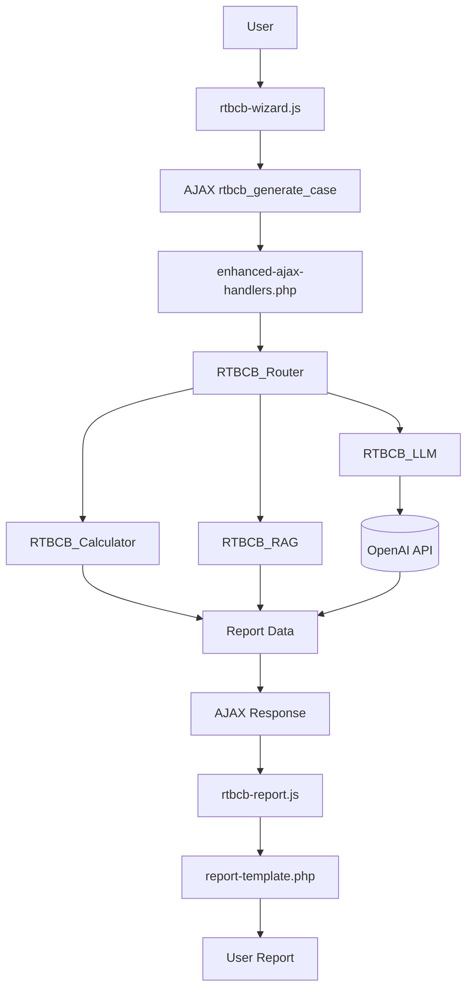

# Real Treasury Business Case Builder

## 1. Project Summary
- **Plugin Name:** Real Treasury – Business Case Builder (Enhanced Pro)
- **Purpose:** Multi-step wizard that gathers company profile and treasury operations data, performs ROI calculations, and invokes a Large Language Model (LLM) to produce a customized business case report for prospective customers of Real Treasury.
- **Primary Audience:**
  - **End Users:** Prospective customers evaluating treasury technology.
  - **Administrators:** Real Treasury marketing and sales teams managing leads and analytics.

## 2. System Architecture & Code Structure
### Root Directory
- [`real-treasury-business-case-builder.php`](real-treasury-business-case-builder.php): Main plugin bootstrap that defines constants, registers hooks, loads classes, and exposes the shortcode that launches the wizard【F:real-treasury-business-case-builder.php†L2-L24】

### Core Logic (`/inc/`)
- [`class-rtbcb-calculator.php`](inc/class-rtbcb-calculator.php): Provides static utilities for computing ROI scenarios from user inputs【F:inc/class-rtbcb-calculator.php†L1-L12】
- [`class-rtbcb-llm.php`](inc/class-rtbcb-llm.php): Builds prompts and communicates with OpenAI GPT models to generate narrative analysis【F:inc/class-rtbcb-llm.php†L1-L58】
- [`class-rtbcb-rag.php`](inc/class-rtbcb-rag.php): Implements Retrieval-Augmented Generation by indexing vendor data and retrieving relevant context for LLM calls【F:inc/class-rtbcb-rag.php†L1-L52】
- [`class-rtbcb-router.php`](inc/class-rtbcb-router.php): Coordinates validation, selects LLM models, invokes calculations, and assembles report HTML【F:inc/class-rtbcb-router.php†L1-L76】
- [`enhanced-ajax-handlers.php`](inc/enhanced-ajax-handlers.php): Contains server-side handlers for AJAX requests and utilities such as API connectivity tests【F:inc/enhanced-ajax-handlers.php†L3-L34】

### Frontend (`/public/`)
- [`js/rtbcb-wizard.js`](public/js/rtbcb-wizard.js): Controls the multi-step form, validates input, and submits data via AJAX【F:public/js/rtbcb-wizard.js†L1-L38】
- [`js/rtbcb-report.js`](public/js/rtbcb-report.js): Renders the returned report HTML and initializes Chart.js visualizations【F:public/js/rtbcb-report.js†L1-L34】

### Admin Interface (`/admin/`)
- [`class-rtbcb-admin.php`](admin/class-rtbcb-admin.php): Registers dashboard menus, enqueues assets, and wires admin AJAX actions【F:admin/class-rtbcb-admin.php†L1-L28】
- [`leads-page-enhanced.php`](admin/leads-page-enhanced.php): Displays captured submissions with filtering, export, and bulk actions【F:admin/leads-page-enhanced.php†L1-L29】
- [`analytics-page.php`](admin/analytics-page.php): Presents usage metrics and charts for lead activity【F:admin/analytics-page.php†L1-L40】

### Templates (`/templates/`)
- [`business-case-form.php`](templates/business-case-form.php): HTML template for the user-facing wizard and modal interface【F:templates/business-case-form.php†L1-L24】
- [`report-template.php`](templates/report-template.php): Basic report layout populated with LLM output【F:templates/report-template.php†L1-L26】
- [`comprehensive-report-template.php`](templates/comprehensive-report-template.php): Extended report with executive summary, operational analysis, and financial details【F:templates/comprehensive-report-template.php†L1-L37】

## 3. Execution Flow & Data Lifecycle
1. **User Interaction:** The shortcode renders `templates/business-case-form.php`, and `public/js/rtbcb-wizard.js` guides the user through a multi-step wizard.
2. **AJAX Request:** On submission, the wizard sends collected data to the WordPress AJAX action `rtbcb_generate_case`.
3. **Backend Handling:** `inc/enhanced-ajax-handlers.php` receives the request and delegates to `RTBCB_Router`.
4. **Data Processing:** The router validates input, runs `RTBCB_Calculator` for ROI figures, and fetches contextual data through `RTBCB_RAG`.
5. **LLM Interaction:** `RTBCB_LLM` formats the prompt with calculations and context, then calls the configured OpenAI model.
6. **Response Parsing:** The JSON reply is parsed into structured fields.
7. **AJAX Response:** Processed numbers and narrative text are returned as JSON, including rendered report HTML.
8. **Report Rendering:** `public/js/rtbcb-report.js` injects the HTML into `templates/report-template.php` (or the comprehensive template) and draws charts.

## 4. Key API Endpoints
| Action | Purpose | Expects | Returns |
| ------ | ------- | ------- | ------- |
| `rtbcb_generate_case` | Generate business case from wizard data | Company profile, operations metrics, pain points | `report_html`, `report_id`, status message |
| `rtbcb_run_llm_test` | Compare multiple LLM models for diagnostics | `modelIds`, `promptA/B`, `maxTokens`, `temperature` | Array of model responses with latency and token metrics |
| `rtbcb_run_rag_test` | Evaluate retrieval quality of the RAG index | `queries`, `topK`, `evaluationMode` | Retrieval results and scoring metrics |
| `rtbcb_api_health_ping` | Check OpenAI API connectivity and rate limits | None beyond nonce | Health status and rate-limit headers |
| `rtbcb_generate_preview_report` | Build a full HTML report in the admin test dashboard | Authenticated request, nonce | Sanitized report HTML |

## 5. Installation & Setup
1. Upload the plugin directory to `wp-content/plugins/` or install the ZIP via the WordPress admin panel, then activate it.
2. Run `composer install` in the plugin folder to fetch PHP dependencies.
3. In the WordPress dashboard, navigate to **Real Treasury → Settings** and enter an OpenAI API key to enable LLM features.

## 6. Testing
- Run all automated checks with:
  ```bash
  bash tests/run-tests.sh
  ```
  The script executes PHP linting, unit tests, integration tests, and JavaScript tests【F:tests/run-tests.sh†L1-L80】
- End-to-end coverage is provided via Cypress tests in [`tests/acceptance.cy.js`](tests/acceptance.cy.js)【F:tests/acceptance.cy.js†L1-L32】

## 7. Visual Architecture Diagram

