# TMS Selection Flash Report Workflow

This document outlines the end-to-end flow powering the TMS Selection Flash Report and the associated Test Dashboard.

## Overall Workflow

```mermaid
graph TD
    subgraph Phase 1: Data Collection & Enrichment
        A[🚀 Start: User Fills Out Dynamic Form] --> B{Form Submission};
        B --> C[🤖 AI Enrichment & Validation];
        C --> D[💾 Store Comprehensive Profile in DB];
    end

    subgraph Phase 2: Analysis & Content Generation
        D --> E[📊 Assess Treasury Maturity];
        E --> F[🔍 RAG-Powered Market & Vendor Analysis];
        F --> G[✍️ Generate Dynamic Value Proposition];
    end

    subgraph Phase 3: ROI & Strategic Recommendation
        G --> H[💰 Calculate Granular ROI & Benefits];
        H --> I[🗺️ Create Phased Implementation Roadmap];
    end

    subgraph Phase 4: Report Assembly & Delivery
        I --> J[📝 Generate Executive Summary];
        J --> K[📄 Assemble Final Report];
        K --> L[💻 Deliver Interactive Web Report];
    end

    subgraph Phase 5: Post-Delivery Engagement
        L --> M[📈 Track User Engagement];
        M --> N[📧 Trigger Personalized Follow-up Sequence];
    end
```

## Phase Details

### Phase 1: 📥 Data Collection & Advanced Enrichment

Objective: Create a deep and accurate profile of the target company.

- **Component:** Dynamic User Input Wizard  
  **Files:** `templates/business-case-form.php`, `public/js/rtbcb-wizard.js`  
  **Function:** Captures a rich dataset through an adaptive, multi-step form with conditional logic.  
  **Data Points:** Financials, Technology Stack, Scored Pain Points, and Strategic Objectives.

- **Component:** Multi-Source AI Data Enrichment  
  **File:** `inc/class-rtbcb-llm.php`  
  **Function:** Augments user data with external information (market position, competitors, financial news) via AI. Validates data against public sources (e.g., SEC filings).

- **Component:** Data Storage & Caching  
  **File:** `inc/class-rtbcb-db.php`  
  **Function:** Stores the complete, validated company profile in a structured database table. Implements a caching layer to prevent redundant API calls.

### Phase 2: 🧠 In-Depth Analysis & Content Generation

Objective: Perform a sophisticated analysis of the company's treasury function and generate tailored, insightful content.

- **Component:** Treasury Maturity Model Assessment  
  **File:** `inc/class-rtbcb-maturity-model.php` (New Module)  
  **Function:** Scores the company on a 4-stage maturity scale (Basic, Developing, Strategic, Optimized) and generates a narrative explaining their current state.

- **Component:** RAG-Powered Marketplace Analysis  
  **File:** `inc/class-rtbcb-rag.php`  
  **Function:** Uses internal data (Tech Portal, articles) to generate a relevant market overview. Performs a cosine similarity search to shortlist 2-3 best-fit vendors.

- **Component:** Dynamic Value Proposition  
  **File:** `templates/comprehensive-report-template.php`  
  **Function:** Uses AI to generate a personalized opening paragraph that connects Real Treasury's value directly to the company's maturity level and challenges.

### Phase 3: 📈 Granular ROI & Strategic Recommendation

Objective: Deliver a detailed financial business case and a clear, actionable technology roadmap.

- **Component:** Granular ROI & Benefits Calculator  
  **File:** `inc/class-rtbcb-calculator.php`  
  **Function:** Calculates a detailed breakdown of hard savings (e.g., reduced bank fees) and soft savings (e.g., automation efficiency). Generates data for a 3-year ROI timeline chart.

- **Component:** Phased Technology Roadmap Generator  
  **File:** `inc/class-rtbcb-category-recommender.php`  
  **Function:** Creates a strategic, multi-phase implementation plan (e.g., Phase 1: Foundational, Phase 2: Automation, Phase 3: Optimization) instead of a single recommendation.

### Phase 4: 📄 Report Assembly & Interactive Delivery

Objective: Create a professional, engaging, and high-impact final report.

- **Component:** Automated Executive Summary  
  **File:** `inc/class-rtbcb-llm.php`  
  **Function:** Makes a final AI call, feeding it all key findings to generate a concise, C-suite-ready Executive Summary.

- **Component:** Interactive Web-Based Report  
  **Files:** `templates/comprehensive-report-template.php`, `public/js/rtbcb-report.js`  
  **Function:** Assembles all generated sections into a final HTML report. Enhances the page with interactive elements like hoverable charts, expandable sections, and a dynamic Call-to-Action.

### Phase 5: 🚀 Post-Delivery Engagement & Lead Nurturing

Objective: Convert the report into an ongoing conversation and nurture the lead.

- **Component:** User Engagement Tracking  
  **Function:** Integrates analytics (e.g., Google Analytics) into the report page to track key interactions (time on page, sections viewed, CTA clicks).

- **Component:** Automated Follow-up Sequence  
  **Function:** Triggers a personalized email sequence based on the user's primary challenges. For example, a user concerned with "FX Volatility" receives targeted content on FX risk management.

## 🧪 Test Dashboard

The WordPress admin includes a dedicated **Test Dashboard** (`admin/test-dashboard-page.php`) for validating key dependencies. A progress bar displays overall completion as each test finishes:

The **Set Company** button uses the company name input and applies it to all tests. Begin with **Run All Tests** to validate the entire flow—the selected company name is passed to every test for accurate coverage. Individual tools can be used afterward if deeper inspection is needed.

The **Connectivity Tests & Status** panel groups the first three checks and replaces the old Data Health page:

1. **OpenAI connectivity** — verifies API key configuration.
2. **Portal integration** — checks the content portal connection.
3. **RAG health** — ensures the retrieval index is available.

Developers can use the dashboard to quickly confirm environment health or trigger the test suite directly from the admin area.

---

This blueprint is the foundation for technical documentation and development planning.
